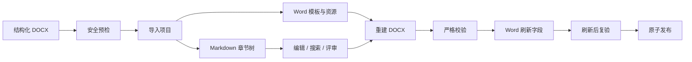

<div align="center">

# Doc Tool

**把大型 Word 文档变成可维护、可审查、可可靠重建的 Markdown 项目。**

面向需求说明书、详细设计、技术手册等结构化长文档的 Windows 桌面工具。


[功能](#功能亮点) · [快速开始](#快速开始) · [工作原理](#工作原理) · [命令行](#命令行) · [参与贡献](#参与贡献) · [迁移指南](docs/migration-guide.md) · [GitHub](https://github.com/wangjie0721666-web/doc-tool)

</div>

> [!IMPORTANT]
> 本仓库已以 **MIT** 许可开源（见 [LICENSE](LICENSE) 与[许可证](#许可证)）。公开仓库导出仍排除内部模板、业务示例与内网地址（见 `packaging/export_public_source.py`）；发布决策登记见 `docs/release/`。

## 为什么需要 Doc Tool？

大型 Word 文档很适合最终交付，却不适合长期协作维护：章节难以拆分、全文变更难审查、复杂资源容易丢失，自动生成后还可能出现目录、页码和样式偏差。

Doc Tool 采用一种更适合工程协作的方式：

- **Word 管版式**：保留封面、样式、页面设置、页眉页脚和复杂资源；
- **目录树管结构**：文件夹和文件名表达章节层级与顺序；
- **Markdown 管内容**：正文可以搜索、审查、批量修改并进入版本控制；
- **质量门禁管交付**：在发布前完成结构、资源、Word 字段和产物完整性校验。

它不是一个追求“任意格式互转”的通用转换器，而是一个面向**长周期文档维护与可靠回写**的工作台。

## 功能亮点

### Word 导入与保真

- 识别 Heading 1～6、正文、图片、普通表格和复杂表格；
- 保留源文档的封面、样式、页面设置、页眉与页脚；
- 导入前展示结构和潜在保真风险；
- 通过试构建和往返差异检查阻止明显损坏的项目落地；
- 使用统一的安全 OOXML 解析策略处理不可信文档。

### Markdown 创作工作台

- 章节树与多标签编辑；
- Markdown 即时预览；
- 全文搜索、正则替换、引用分析；
- 章节重命名、重编号和关联引用更新；
- 拼写检查、术语一致性检查、代码片段；
- 图片粘贴、拖放、缺失引用修复和未使用资源清理；
- Mermaid 流程图和时序图编辑、预览与 PNG 导出。

### 安全编辑与恢复

- 未保存内容保护和“保存全部”；
- 自动草稿与崩溃恢复；
- 工作区、标签页和布局会话恢复；
- 文件改动对比、单文件恢复和可回滚删除；
- 项目锁与只读兼容模式，避免并发写入或旧版本破坏新项目。

### 校验与发布

- 章节编号、Markdown、图片、复杂表格和模板校验；
- 统一问题中心、质量规则和评审意见；
- 诊断构建与正式构建分离；
- Microsoft Word 独立进程刷新 TOC、页码和 `NUMPAGES`；
- 刷新后再次校验，并通过原子替换发布产物；
- JSON、SARIF、JUnit 等机器可读输出，可接入 CI。

## 界面预览

项目正在准备可公开使用的脱敏截图和演示文档。公开发布时建议在此加入：

1. 项目工作台全景；
2. Word 导入预检；
3. Markdown 编辑与预览；
4. 正式构建结果和问题中心。

<!--
公开截图就绪后替换为：

-->

## 工作原理



正式构建失败时不会覆盖上一份有效输出。Word 字段刷新使用本次任务专用的隐藏进程，不会复用或关闭用户已经打开的 Word 窗口。

## 快速开始

### 系统要求

- Windows 10 或 Windows 11；
- Python 3.13；
- Microsoft Word，仅正式构建和最终字段验收需要；
- 建议使用 Git 管理 Markdown 项目，但运行工具本身不依赖 Git。

当前桌面应用仅支持 Windows。无 Word 环境可以完成导入、编辑、校验和诊断构建，但不能将结果视为正式 Word 交付物。

### 从源码运行

```powershell
git clone <公开仓库地址>
cd doc-tool
python -m pip install -r requirements.txt
python -m doc_tool.app
```

公开仓库地址确定后，请将上面的占位符替换为真实 HTTPS 地址。

在 Windows 中也可以双击 `start-doc-tool.cmd`。如果 PySide6 缺失，启动器会提示安装；受终端安全软件限制、无法正常使用 pip 时，可以运行：

```powershell
python scripts\setup_pyside6.py
```

### 安装版

项目支持通过 PyInstaller 和 Inno Setup 生成独立安装包，最终用户无需安装 Python。公开 Release 建立后，可在这里提供下载入口和 SHA-256 校验说明。

安装器与便携包同策略：开始菜单/桌面快捷方式通过启动器把程序复制到 `%TEMP%` 下全新随机目录再启动，规避安全软件对未签名 exe 的拦截；安装时若默认目录含中文等非 ASCII 字符（如中文 Windows 用户名导致 `C:\Users\张三\...`），会自动改用 `C:\ProgramData\DocTool` 并提示。自 1.4.3 起，产物内所有 exe/dll/pyd 均带公司自签名证书签名，安装目录内置 `安装证书.cmd`（一键导入信任，做一次即可），导入信任后的机器可直接双击 `DocTool.exe` 启动。

```powershell
Get-FileHash .\DocTool-Setup-X.Y.Z.exe -Algorithm SHA256
```

### 免安装（便携包）

Release 同时提供 `DocTool-X.Y.Z-portable.zip`：解压到任意目录（不要只拎出 `DocTool.exe`，它依赖同目录的 `_internal\`），按根部的「请先读我.txt」操作：首次双击 `安装证书.cmd` 导入公司证书（一次即可），之后双击 `启动DocTool.cmd` 启动，不需要管理员权限，也不写注册表。

自 1.4.2 起，即使直接双击 `DocTool.exe`，程序在检测到扩展模块被安全软件拦截时也会自动把整个目录迁移到 `%TEMP%` 下的稳定目录并自行重启（失败会弹窗并写 `DocTool-startup.log`）；导入公司证书后即可直接双击 `DocTool.exe`。zip 根部的 `diagnose.cmd` 是诊断工具：遇到问题时双击运行，把生成的 `DocTool-diagnose.txt` 发给维护人员。

如果安全软件仍然拦截，请联系 IT 把安装目录加入信任区/执行控制白名单，或为 exe 配置代码签名证书（见 `docs/code-signing-certificate.md`）。

## 使用方法

面向使用者的一页说明见 [使用说明](docs/使用说明.md)（打开程序、建项目、日常编辑、修订记录、出稿三档与常见问题）。本节只列主干流程。

### 1. 创建项目

1. 启动应用并选择“新建项目…”；
2. 选择具有 Heading 1～6 结构的 `.docx`；
3. 查看导入预检结果：标题层级、图片/表格数量和保真风险；
4. 确认标题与正文的样式映射；
5. 填写文档编号、名称、版本并指定项目目录；
6. 等待导入、试构建和往返检查完成。

新建的项目一律是通用文档（`general`）。`requirement` 和 `design` 是历史项目使用的规则预设，仍可打开与构建，但不再用于新建；它们只额外启用各自的质量规则，不影响通用文档工作流。

### 2. 编辑项目

打开包含 `project.yml` 的目录，然后在章节树中选择 Markdown 文件。可以使用内置编辑器，也可以使用 VS Code、Typora 等外部编辑器。

应用会记录自动草稿和会话状态。异常退出后再次打开项目时，恢复操作需要用户确认，不会静默覆盖正式内容。

### 3. 维护修订记录

修订记录只维护一处：`content/<类型>/_revision_record.md`。出稿前在表格末尾加一行（版本、摘要、日期、修改人），摘要里换行写 `<br>`、竖线写 `\|`。

**末行版本号即本次文档版本号**，会同步到 `project.yml`、模板封面的「版本号」和输出文件名。首次出稿时该文件不存在，程序会从模板的修订记录表自动提取一份。

### 4. 校验和构建

- **校验项目**（F5）：只检查结构、内容与资源；
- **诊断构建（无 Word）**（Ctrl+Shift+B）：重建 DOCX，但跳过 Word 字段刷新；
- **正式合并**：构建、刷新字段、复验并发布可交付 DOCX，失败自动回滚。

正式产物位于项目的 `output/`，运行和质量报告位于 `logs/`。

## 项目格式

导入后的项目是自包含、可移动的目录：

```text
my-document/
├─ project.yml                 # 项目元数据和相对路径
├─ original/
│  └─ source.docx             # 导入时保存的源文件副本
├─ template/
│  └─ template.docx           # Word 版式与样式模板
├─ content/
│  └─ general/
│     └─ ...                  # Markdown 章节树
├─ assets/
│  └─ general/
│     ├─ images/              # 图片
│     └─ tables/              # 复杂表格 OOXML
├─ output/                    # 构建产物
├─ logs/                      # 日志和质量报告
└─ .state/                    # 草稿、锁、会话和回滚状态
```

所有清单路径都相对于项目根目录，因此项目可以整体复制。`.state/` 由应用管理，不建议手工修改或加入版本控制。

### 章节树约定

```text
content/general/
└─ 第3章 功能需求/                 # Word Heading 1
   └─ 3.1 用户管理/                # Word Heading 2
      ├─ _index.md                # 可选：父标题自身正文
      ├─ 3.1.1 用户列表.md         # Word Heading 3
      └─ 3.1.2 新增用户.md
```

- 一级目录采用 `第N章 标题`；
- 二级及以下采用 `N.N 标题`；
- 同级编号必须连续，不能重复、跳号或使用错误的父编号；
- 父标题既有正文又有子章节时，将父正文写入 `_index.md`；
- 文件内部标题必须深于文件自身代表的 Word Heading；
- 推荐使用应用内的重命名/重编号功能修改章节结构。

### 支持的 Markdown 扩展

Word 段落内换行：

```markdown
第一行<br>第二行
```

带尺寸的图片：

```markdown

```

复杂 Word 表格会保存为独立 OOXML，并在 Markdown 中使用 `<!-- TABLE:... -->` 引用。可以移动或删除完整引用，但不要手工编辑表格 XML。

更完整的格式说明将在公开文档站或 `docs/` 中维护，避免 README 变成冗长的用户手册。

## 命令行

统一入口为 `python doc_tool_cli.py`，也可以运行 `python -m doc_tool.cli`。

```powershell
# 查看版本和构建信息
python doc_tool_cli.py --version

# 导入预检
python doc_tool_cli.py preflight --docx D:\docs\source.docx

# 导入通用文档
python doc_tool_cli.py import `
  --docx D:\docs\source.docx `
  --name my-document `
  --target-dir D:\projects `
  --document-type general

# 正式构建
python doc_tool_cli.py build --project D:\projects\my-document

# 无 Word 诊断构建
python doc_tool_cli.py build --project D:\projects\my-document --skip-word-refresh

# 质量命令
python doc_tool_cli.py validate --project D:\projects\my-document
python doc_tool_cli.py lint --project D:\projects\my-document
python doc_tool_cli.py status --project D:\projects\my-document --output json
python doc_tool_cli.py search --project D:\projects\my-document --query "keyword"

# CI 报告
python doc_tool_cli.py validate --project D:\projects\my-document --format sarif
python doc_tool_cli.py validate --project D:\projects\my-document --format junit
```

`--project` 可以重复传入，以便一次处理多个项目。`preflight`、`import`、`validate`、`lint`、`search` 和 `status` 支持 JSON 输出；`validate` 支持 SARIF/JUnit，`lint` 支持 SARIF。质量门禁或执行失败时命令返回非零退出码。

## 开发

安装运行和构建依赖：

```powershell
python -m pip install -r requirements.txt -r requirements-build.txt
```

运行完整测试：

```powershell
python scripts\tests\run_tests.py
```

运行指定测试或覆盖率门禁：

```powershell
python scripts\tests\run_tests.py test_cli_machine.py test_project_build.py
python scripts\tests\run_tests.py --coverage --coverage-min 80
```

### 打包

三条打包链路，同一份 PyInstaller 规格（`packaging/doc_tool.spec`，onedir），按用途选：

| 入口 | 产物 | 包含步骤 | 需要 Inno Setup |
| --- | --- | --- | --- |
| `build_exe.ps1` | `dist\DocTool\`、便携 zip | PyInstaller、产物内容校验、冻结冒烟 | 否 |
| `packaging\build.ps1` | 安装器 `DocTool-Setup-X.Y.Z.exe` | 泄漏扫描、PyInstaller、严格泄漏扫描、冻结冒烟、Inno Setup、SHA-256 与依赖清单 | 是 |
| `.gitlab-ci.yml`（推 `vX.Y.Z` 标签触发） | Release 全套资产 | 版本一致性、测试与覆盖率门禁、依赖审计、SBOM、净化源码导出扫描、PyInstaller、严格泄漏扫描、公共发布门禁、可选代码签名、Inno Setup、安装级冒烟、SHA-256、便携 zip | 是（在 Runner 上） |

日常与团队分发用轻量脚本即可（也可双击 `打包成exe.cmd`，参数原样透传）：

```powershell
.\build_exe.ps1 -Portable      # onedir + dist\DocTool-X.Y.Z-portable.zip（免安装分发）
.\build_exe.ps1 -OneFile       # 单文件 exe，使用 packaging\doc_tool_onefile.spec
.\build_exe.ps1 -SkipTests     # 跳过产物校验与冻结冒烟
```

要点：

- `build_exe.ps1` **不跑**泄漏扫描与发布门禁，只适合本地迭代和内部分发；正式对外产物必须走 tag 流水线。
- `packaging\build.ps1` 的 `release_gate.py` 只报告状态，硬阻断只在 CI 的 `--public` 模式。
- 两个本地脚本优先使用仓库自带的 vendored 运行时（`build\pyinstaller-tool`、`build\pyside-runtime`），规避 pip 被终端安全软件拦截；PyInstaller 低于 `requirements-build.txt` 锁定版本会直接报错（旧版在 Python 3.13 上会打出扩展模块加载失败的坏包）。
- 便携包的启动脚本在 `packaging\portable\启动DocTool.cmd`，必须保持纯 ASCII（cmd.exe 按系统 ANSI 代码页解析批处理文件）。
- 安装器与便携包共用「复制到 `%TEMP%` 全新随机目录再启动」策略规避安全软件拦截（启动器在 `packaging\installed\启动DocTool.cmd`）；安装器另做非 ASCII 安装目录检测——中文 Windows 用户名下默认目录含中文，PyInstaller 引导程序会报 `Failed to start embedded python interpreter!`，检测到时会自动改用 `{commonappdata}\DocTool` 并提示（见 `packaging/installer.iss` 的 `[Code]`）。

发布版本时需同步 5 处版本标识：`doc_tool/domain/version.py`、`.gitlab-ci.yml`、README 徽章、`packaging/build.ps1`、`packaging/installer.iss`；CI 的 `validate-version` 会校验标签与后三者一致，并要求工作树干净（含未跟踪文件）。

### 代码结构

```text
doc_tool/
├─ domain/                    领域模型、路径、安全和错误定义
├─ application/               导入、内容、质量、评审和构建用例
├─ adapters/                  DOCX 内核与外部能力适配
├─ ui/                        PySide6 桌面界面
└─ resources/                 应用运行资源
scripts/                      构建、校验、字段刷新和测试
packaging/                    PyInstaller、安装器、审计与 SBOM
openspec/                     功能规格、设计和变更任务
```

## 路线图

当前优先级：

- [x] Word → Markdown 项目导入；
- [x] Markdown 工作台和可靠 Word 重建；
- [x] 自动草稿、恢复与变更回滚；
- [x] 保真检查、问题中心和机器可读 CLI；
- [ ] 完成公共品牌、截图和脱敏示例；
- [ ] 发布可复现的 Windows 安装包；
- [ ] 建立公开文档站和示例项目；
- [ ] 完善 macOS/Linux 上不依赖 Word 的工作流；
- [ ] 评估 LibreOffice 字段刷新后端；
- [ ] 插件化文档类型、模板和质量规则。

更细的设计和计划位于 `openspec/` 与 `docs/roadmap.md`。公开 Issue 系统启用后，路线图将以 Issue/Milestone 为准。

## 参与贡献

欢迎通过 [GitHub 仓库](https://github.com/wangjie0721666-web/doc-tool) 提交缺陷报告、功能建议、文档改进和代码贡献（见 [CONTRIBUTING.md](CONTRIBUTING.md) 与 [CODE_OF_CONDUCT.md](CODE_OF_CONDUCT.md)）。

建议的贡献流程：

1. Fork 仓库；
2. 从主分支创建功能分支；
3. 为行为变更补充测试和文档；
4. 运行完整测试，确保没有引入真实业务文档或敏感数据；
5. 提交清晰、范围单一的 Pull Request。

```powershell
git checkout -b feature/short-description
python scripts\tests\run_tests.py
git commit -m "feat: describe the change"
```

首次贡献可以从文档、测试、错误信息、可访问性和带有 `good first issue` 标签的任务开始。

## 安全

请不要在公开 Issue 中披露可利用的安全漏洞、恶意 DOCX 样本或敏感文档。请通过仓库的私密安全报告渠道提交（见 [SECURITY.md](SECURITY.md)，说明支持版本与响应流程）。

处理不可信 Word 文件存在解析和资源消耗风险。虽然项目包含路径约束、OOXML 安全检查和构建隔离，但在安全报告流程完善前，不建议把它部署为接收匿名公网文件的无人值守服务。

## 开源准备状态

要把当前仓库安全地公开，还需要完成（已完成项已勾选）：

- [x] 已选择 MIT 许可证并添加 `LICENSE`（见[许可证](#许可证)与发布决策登记表）；
- [x] 项目名称、图标、公司名称和商标的公开使用授权已登记决策
      （`docs/release/02-release-decisions.md`；最终商标检索随正式公共 URL 确定前复签）；
- [x] 公共源码导出已排除 `templates/`、`content/`、`assets/` 等内部业务材料
      （`packaging/export_public_source.py`，随发布门禁执行）；
- [x] 公开仓库使用全新净化导出历史（`packaging/export_public_source.py`），
      不携带内部提交与敏感数据；内部仓库历史清理仍为独立审批事项；
- [x] 建立公开仓库、Issue/PR 模板、贡献指南、行为准则和安全策略
      （`CONTRIBUTING.md`、`CODE_OF_CONDUCT.md`、`SECURITY.md`、`.github/`）；
- [x] 准备脱敏测试夹具与虚构示例项目（`examples/galaxy-user-manual/`）；
- [x] 审核第三方依赖许可证、安装包内容和 SBOM（`THIRD_PARTY_LICENSES.txt` 含
      PySide6/Qt 动态链接说明）；
- [x] 发布门禁：品牌/内网/凭据/OOXML 内容扫描与授权门禁
      （`packaging/scan_leaks.py`、`packaging/release_gate.py`）。

> 只从当前工作树删除敏感文件并不够；如果内容曾被提交，还必须清理 Git 历史，并在公开前轮换可能暴露的凭据。

## 限制

- 当前仅提供 Windows 桌面应用；
- 正式 DOCX 字段刷新依赖桌面版 Microsoft Word；
- 仅支持有规范 Heading 结构的 `.docx`，不支持旧 `.doc`；
- 极复杂的 Word 对象可能只能作为 OOXML 资源保留，不能直接在 Markdown 中编辑；
- 诊断构建不等同于完成 Word 字段刷新和人工视觉验收；
- 生成的 `output/` 不是内容源，不应反向覆盖 Markdown 项目。

## 许可证

**MIT License。** 本仓库以 [MIT](LICENSE) 许可开源（Copyright (c) 2026 Doc Tool Project），允许复制、修改、分发与再许可，需保留版权与许可声明。许可证与著作权主体的选择记录在[发布决策登记表](docs/release/02-release-decisions.md)。

第三方依赖的许可证信息见 [THIRD_PARTY_LICENSES.txt](THIRD_PARTY_LICENSES.txt)。第三方组件仍分别受其原始许可证约束。

## 致谢

本项目使用 Python、PySide6、lxml、PyYAML、Pillow、pywin32、ReportLab、pypdf、PyInstaller 和 Inno Setup 构建。感谢这些项目及其贡献者。

---

如果这个项目对你有帮助，欢迎在 [GitHub 仓库](https://github.com/wangjie0721666-web/doc-tool) 提交 Issue、参与讨论或贡献代码。
