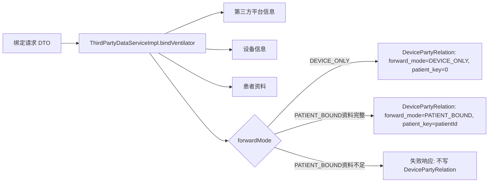

#### 功能描述

<!-- TBL:style=45 type=auto tw=0 cols=1343,8295 cm=0,108,0,108 ind=0:dxa lay=autofit bd=single:auto:4:0 -->
| 需求编号 | BREATHE-THIRD-FORWARD-001 |
| --- | --- |
| 设计编号 | Design-THIRD-VENTILATOR-BIND-001 |
| 功能描述 | 第三方平台通过呼吸机绑定接口建立转发关系。系统支持患者向 PATIENT_BOUND 绑定和设备向 DEVICE_ONLY 绑定；患者向用于按设备和患者转发，设备向用于按设备维度转发。 |
| 设计定位 | 绑定逻辑仅负责校验第三方身份、设备、患者资料和机构范围，并写入正式绑定关系或返回明确失败；绑定接口不直接执行数据外发，也不引入中间绑定补偿生命周期。 |
| 核心机制 | 1. 第三方鉴权：基于 appKey、time、deviceCode 等信息识别第三方平台。 2. 模式区分：DEVICE_ONLY 按设备建立关系，PATIENT_BOUND 按设备和患者建立关系。 3. 资料校验：设备向不要求患者资料，患者向需校验患者资料、设备患者关系和机构范围。 4. 资料不足失败：患者向资料不足时明确失败，不写正式绑定，不创建 pending binding、中间表或自动补偿任务。 5. 多平台并存：同一设备可分别建立多个第三方平台的绑定关系。 |

<EMPTY_PAR/>
#### 流程图

```mermaid

flowchart TD

A[第三方调用呼吸机绑定接口] --> B[校验 appKey、time、deviceCode]

B --> C[识别第三方平台]

C --> D{绑定模式}

<EMPTY_PAR/>
D -- DEVICE_ONLY --> E[校验设备存在与平台可访问范围]

E --> F[写入 DEVICE_ONLY 正式绑定]

<EMPTY_PAR/>
D -- PATIENT_BOUND --> G[校验患者资料]

G --> H[校验设备当前患者关系]

H --> I[校验机构归属]

I --> J{患者向资料是否完整}

J -- 是 --> K[写入 PATIENT_BOUND 正式绑定]

J -- 否 --> L[返回绑定失败，不写绑定记录]

<EMPTY_PAR/>
F --> M[返回绑定结果]

K --> M

L --> M

```

#### 时序图

```mermaid

sequenceDiagram

participant TP as 第三方系统

participant API as ThirdController

participant SVC as ThirdPartyDataServiceImpl

participant DEV as Device Service

participant DB as DevicePartyRelation

<EMPTY_PAR/>
TP->>API: POST 呼吸机绑定请求

API->>SVC: bindVentilator(dto)

SVC->>SVC: 校验第三方身份

alt DEVICE_ONLY

SVC->>SVC: 校验设备存在与机构范围

SVC->>DEV: bindVentilator(DEVICE_ONLY)

DEV->>DB: 写入设备向绑定

else PATIENT_BOUND 且资料完整

SVC->>SVC: 校验患者、设备患者关系、机构范围

SVC->>DEV: bindVentilator(PATIENT_BOUND)

DEV->>DB: 写入患者向绑定

else PATIENT_BOUND 且资料不足

SVC->>SVC: 构造明确失败原因

end

DEV-->>SVC: 正式绑定处理结果

SVC-->>API: ThirdPartyVo

API-->>TP: Success/Fail

```

#### 数据流图



#### 方法设计

<!-- TBL:style=45 type=auto tw=0 cols=2466,2389,2353,2646 cm=0,108,0,108 ind=0:dxa lay=autofit bd=single:auto:4:0 -->
| 核心方法/入口 | 输入 | 输出 | 设计说明 |
| --- | --- | --- | --- |
| /third/ventilator/bind | ThirdVentilatorDto | ThirdPartyVo | 呼吸机患者向绑定入口，按 PATIENT_BOUND 语义建立绑定关系。 |
| /third/ventilator/v2/bind | ThirdVentilatorV2Dto | ThirdPartyVo | 呼吸机 V2 模式感知绑定入口，支持 DEVICE_ONLY 与 PATIENT_BOUND，使用 HMAC-SHA256 鉴权并要求签名路径固定为 /third/ventilator/v2/bind。 |
| bindVentilator | 绑定 DTO | ThirdPartyVo | 校验第三方、设备、患者和机构范围后调用设备侧绑定。 |
| 设备侧 bindVentilatorV2 | 平台、设备、模式、患者资料 | R | 资料满足时写入正式绑定；患者向资料不足时返回明确失败，不创建中间绑定记录。 |
| 患者向资料完整性校验，方法名待确认 | 患者资料、设备患者关系、机构信息 | 校验结果 | 在写入 PATIENT_BOUND 前完成校验，缺少必要关系时阻断绑定。 |

<EMPTY_PAR/>
#### 核心逻辑

<!-- TBL:style=45 type=auto tw=0 cols=1011,7500,1343 cm=0,108,0,108 ind=0:dxa lay=autofit bd=single:auto:4:0 -->
| 序号 | 设计规则 | 关注点 |
| --- | --- | --- |
| 1 | 呼吸机绑定按转发模式分为 DEVICE_ONLY 和 PATIENT_BOUND。 | 约束规则 |
| 2 | DEVICE_ONLY 绑定只校验第三方平台、设备存在性和可访问范围，不要求患者资料。 | 约束规则 |
| 3 | DEVICE_ONLY 正式绑定写入 device_party_relation，forward_mode=DEVICE_ONLY，patient_key=0。 | 处理步骤 |
| 4 | PATIENT_BOUND 绑定需校验患者资料、设备当前患者关系和机构归属。 | 约束规则 |
| 5 | PATIENT_BOUND 资料完整时写入正式绑定，forward_mode=PATIENT_BOUND，patient_key=patientId。 | 处理步骤 |
| 6 | PATIENT_BOUND 资料不足时返回明确失败，不写入正式有效绑定，不创建 pending binding、中间表、补偿任务或自动完成生命周期。 | 异常与边界 |
| 7 | 患者向资料不足或绑定失败不影响呼吸机原始数据入库、分钟聚合、报告生成，也不阻塞符合条件的设备向转发。 | 异常与边界 |
| 8 | 同一设备可绑定多个第三方平台；不同平台关系相互独立。 | 处理规则 |
| 9 | 同一设备可同时存在设备向和患者向绑定；两种模式互不覆盖。 | 处理规则 |
| 10 | 第一批新增 device_party_relation.forward_mode、device_party_relation.patient_key 和活动绑定唯一哈希生成列；不做 NOT NULL 收紧。 | 处理步骤 |
| 11 | 活跃绑定唯一性在服务逻辑和数据库唯一索引中按 tenantId + partyId/thirdId + deviceId/deviceCode + forwardMode + patientKey + delFlag=0 校验。 | 约束规则 |
| 12 | 历史 patient_id IS NOT NULL 活跃记录回填为 PATIENT_BOUND；历史 patient_id IS NULL 活跃记录仅审计输出，不自动转换为 DEVICE_ONLY。 | 兼容与上线 |
