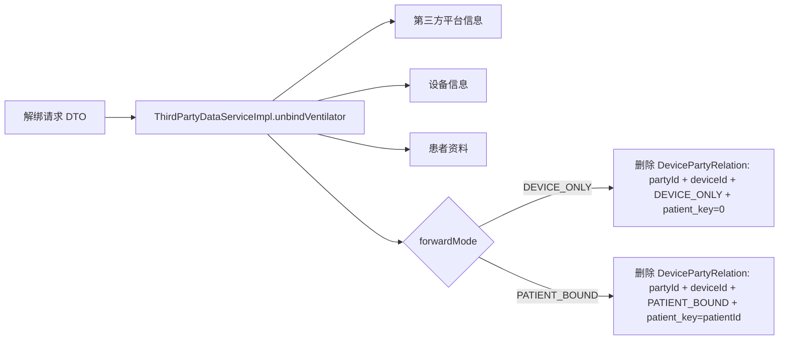

#### 功能描述

<!-- TBL:style=45 type=auto tw=0 cols=1493,8145 cm=0,108,0,108 ind=0:dxa lay=autofit bd=single:auto:4:0 va=top -->
| 需求编号 | BREATHE-THIRD-FORWARD-001 |
| --- | --- |
| 设计编号 | Design-THIRD-VENTILATOR-UNBIND-001 |
| 功能描述 | 第三方平台通过呼吸机解绑接口删除既有转发关系。系统支持按平台、设备、转发模式和患者键精确删除设备向或患者向绑定。 |
| 设计定位 | 解绑逻辑仅负责删除绑定关系，不直接触发数据外发，不删除历史外发日志和呼吸机业务数据；解绑结果只影响后续外发目标匹配。 |
| 核心机制 | 1. 模式识别：按 DEVICE_ONLY 或 PATIENT_BOUND 确定解绑范围。 2. 精确定位：按第三方平台、设备、模式、患者键定位绑定关系。 3. 平台隔离：解绑某平台不影响其他平台。 4. 模式隔离：解绑设备向不影响患者向，解绑患者向不影响设备向。 |

<EMPTY_PAR/>
#### 流程图

```mermaid

flowchart TD

A[第三方调用呼吸机解绑接口] --> B[校验 appKey、time、deviceCode]

B --> C[识别第三方平台]

C --> D{解绑模式}

<EMPTY_PAR/>
D -- DEVICE_ONLY --> E[校验设备存在与平台可访问范围]

E --> F[按平台 + 设备 + DEVICE_ONLY + patient_key=0 删除]

<EMPTY_PAR/>
D -- PATIENT_BOUND --> G[校验患者资料]

G --> H[校验设备当前患者关系]

H --> I[校验机构归属]

I --> J[按平台 + 设备 + PATIENT_BOUND + patient_key 删除]

<EMPTY_PAR/>
F --> K[返回解绑结果]

J --> K

```

#### 时序图

```mermaid

sequenceDiagram

participant TP as 第三方系统

participant API as ThirdController

participant SVC as ThirdPartyDataServiceImpl

participant DEV as Device Service

participant DB as DevicePartyRelation

<EMPTY_PAR/>
TP->>API: POST 呼吸机解绑请求

API->>SVC: unbindVentilator(dto)

SVC->>SVC: 校验第三方身份、设备、模式

alt DEVICE_ONLY

SVC->>DEV: unbindVentilator(DEVICE_ONLY)

DEV->>DB: 删除匹配设备向绑定

else PATIENT_BOUND

SVC->>SVC: 校验患者资料、设备患者关系、机构范围

SVC->>DEV: unbindVentilator(PATIENT_BOUND)

DEV->>DB: 删除匹配患者向绑定

end

DEV-->>SVC: 处理结果

SVC-->>API: ThirdPartyVo

API-->>TP: Success/Fail

```

#### 数据流图



#### 方法设计

<!-- TBL:style=45 type=auto tw=0 cols=2646,2295,2087,2826 cm=0,108,0,108 ind=0:dxa lay=autofit bd=single:auto:4:0 -->
| 核心方法/入口 | 输入 | 输出 | 设计说明 |
| --- | --- | --- | --- |
| /third/ventilator/unbind | ThirdVentilatorDto | ThirdPartyVo | 呼吸机患者向解绑入口，按 PATIENT_BOUND 语义删除绑定关系。 |
| /third/ventilator/v2/unbind | ThirdVentilatorV2Dto | ThirdPartyVo | 呼吸机 V2 模式感知解绑入口，支持按模式精确解绑，使用 HMAC-SHA256 鉴权并要求签名路径固定为 /third/ventilator/v2/unbind。 |
| unbindVentilator | 解绑 DTO | ThirdPartyVo | 校验第三方、设备、患者和机构范围后调用设备侧解绑。 |
| 设备侧 unbindVentilatorV2 | 平台、设备、模式、患者键 | R | 仅删除匹配平台、设备、模式和患者键的绑定关系。 |

<EMPTY_PAR/>
#### 核心逻辑

<!-- TBL:style=45 type=auto tw=0 cols=893,7500,1246 cm=0,108,0,108 ind=0:dxa lay=autofit bd=single:auto:4:0 -->
| 序号 | 设计规则 | 关注点 |
| --- | --- | --- |
| 1 | 呼吸机解绑按转发模式分为 DEVICE_ONLY 和 PATIENT_BOUND。 | 约束规则 |
| 2 | DEVICE_ONLY 解绑按第三方平台、设备、forward_mode=DEVICE_ONLY、patient_key=0 定位关系。 | 约束规则 |
| 3 | PATIENT_BOUND 解绑按第三方平台、设备、forward_mode=PATIENT_BOUND、patient_key=patientId 定位关系。 | 约束规则 |
| 4 | 解绑 A 平台不得删除 B 平台绑定。 | 异常与边界 |
| 5 | 解绑设备向不得删除患者向绑定，解绑患者向不得删除设备向绑定。 | 异常与边界 |
| 6 | 解绑某患者不得影响同设备其他患者的患者向绑定。 | 异常与边界 |
| 7 | 解绑成功只表示关系删除完成，不在解绑接口内触发第三方推送。 | 约束规则 |
| 8 | 解绑不删除历史外发日志，不删除呼吸机原始数据、统计数据和报告数据。 | 兼容与上线 |
| 9 | 解绑后的影响体现在后续外发目标查询和 MQ 消费链路。 | 处理步骤 |
