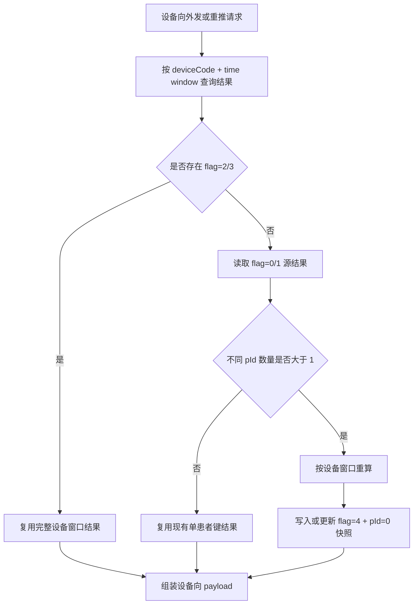
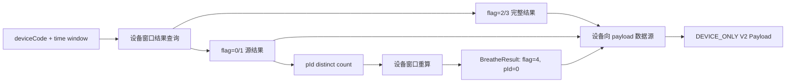

#### 功能描述

<!-- TBL:style=45 type=auto tw=0 cols=1504,8134 cm=0,108,0,108 ind=0:dxa lay=autofit bd=single:auto:4:0 va=top -->
| 需求编号 | BREATHE-THIRD-FORWARD-001 |
| --- | --- |
| 设计编号 | Design-THIRD-VENTILATOR-DEVICE-SNAPSHOT-001 |
| 功能描述 | 设备向外发需要按设备和时间窗口准备完整结果数据。当原始或分钟级数据后续归档导致重推无法重新计算时，系统在必要场景下持久化设备口径重算结果，供设备向重试和人工重推使用。 |
| 设计定位 | 该能力只服务 DEVICE_ONLY 外发、重试和重推；不改变患者报告、患者向外发和患者维度统计的默认查询语义。 |
| 核心机制 | 1. 设备窗口取数：按 deviceCode + time window 读取，不按患者过滤。 2. 完整结果复用：优先复用已确认完整的 flag=2/3 结果。 3. 条件快照：仅在 flag=0/1 且同一窗口存在多个不同 pId 时写入 flag=4 + pId=0。 4. 患者侧隔离：患者报告、患者向外发和患者统计默认排除 flag=4。 |

<EMPTY_PAR/>
#### 流程图



#### 时序图

```mermaid

sequenceDiagram

participant PUSH as pushThirdData

participant PREP as DeviceOnlyResultPrepareService

participant REPO as BreatheResultRepository

participant CALC as Recalculate Service

participant LOG as DeviceThirdLog

<EMPTY_PAR/>
PUSH->>PREP: prepare(deviceCode, window)

PREP->>REPO: queryByDeviceWindow(deviceCode, window)

alt 找到 flag=2/3

REPO-->>PREP: 完整设备窗口结果

else flag=0/1 且 pId 数量 <= 1

REPO-->>PREP: 可复用源结果

else flag=0/1 且多个 pId

PREP->>CALC: recalcByDeviceWindow(deviceCode, window)

CALC-->>PREP: 设备口径结果

PREP->>REPO: saveOrUpdate(flag=4, pId=0)

end

PREP-->>PUSH: 设备向结果数据

PUSH->>LOG: 记录设备向外发结果

```

#### 数据流图



#### 方法设计

<!-- TBL:style=45 type=auto tw=0 cols=3276,2047,2354,2177 cm=0,108,0,108 ind=0:dxa lay=autofit bd=single:auto:4:0 -->
| 核心方法/入口 | 中文含义 | 输入 / 输出 | 实际职责说明 |
| --- | --- | --- | --- |
| DataSourceEnum.DEVICE_RECAL_RESULT | 设备口径重算结果枚举 | 4 -> 设备口径重算结果 | 标识 flag=4 的设备口径快照来源。 |
| 设备窗口结果查询，方法名待确认 | 按设备窗口查询结果 | deviceCode, windowStart, windowEnd -> result list | 不按 patientId 过滤；默认排除已有 flag=4，除非显式执行重试/重推快照读取。 |
| prepareDeviceOnlyResult，方法名待确认 | 准备设备向结果 | deviceCode, time window -> result | 按 flag=2/3、flag=0/1 和不同 pId 数量决定复用或重算。 |
| 设备窗口重算，方法名待确认 | 设备口径重算 | deviceCode, time window -> result | 对多个患者键的窗口按整机口径生成可外发结果，不按患者使用时段切割。 |
| saveOrUpdateDeviceSnapshot，方法名待确认 | 写入设备快照 | deviceNo, pId=0, cureTime/windowStart, flag=4 -> result | 使用独立定位条件写入/更新快照，避免覆盖真实患者结果。 |
| 患者侧查询过滤，方法名待确认 | 排除设备快照 | 患者报告、患者向外发、患者统计查询 | 默认增加 flag != 4 或等价条件，除非显式请求设备向快照。 |

<EMPTY_PAR/>
#### 核心逻辑

<!-- TBL:style=45 type=auto tw=0 cols=904,7543,1192 cm=0,108,0,108 ind=0:dxa lay=autofit bd=single:auto:4:0 -->
| 序号 | 设计规则 | 关注点 |
| --- | --- | --- |
| 1 | 设备向结果准备入口必须以 deviceCode + time window 为边界，不以 patientId 为必需条件。 | 约束规则 |
| 2 | 若查询到 flag=2/3 结果，因其已确认为完整设备窗口结果，可直接复用，不额外写入 flag=4。 | 处理步骤 |
| 3 | 若仅查询到 flag=0/1 且不同 pId 数量不超过 1，可直接复用现有结果；null 按一个独立 pId 值计数。 | 约束规则 |
| 4 | 若仅查询到 flag=0/1 且不同 pId 数量大于 1，需按设备窗口重算，并持久化为 flag=4 + pId=0。 | 约束规则 |
| 5 | flag=4 写入或更新必须按 deviceNo + pId=0 + cureTime/windowStart + flag=4 + delFlag=0 定位。 | 约束规则 |
| 6 | 普通患者结果保存/更新不得覆盖 flag=4 + pId=0；设备快照写入不得覆盖真实患者结果。 | 异常与边界 |
| 7 | 患者报告、患者向外发和患者维度统计默认排除 flag=4，防止设备口径数据污染患者侧结果。 | 处理规则 |
| 8 | 设备向重试/重推可显式读取 flag=4 + pId=0，用于原始或分钟级数据归档后的回放。 | 处理规则 |
| 9 | 设备向设置数据、事件数据、面罩佩戴数据和 checkData 提取应使用设备窗口范围或显式设备快照，不得误用患者过滤。 | 异常与边界 |
| 10 | flag=4 设备口径快照已纳入当前分支实现，历史清理、回滚和生产补偿策略仍需在上线前确认。 | 约束规则 |
