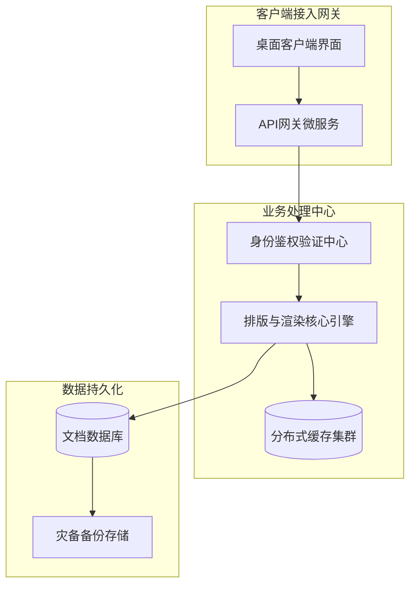
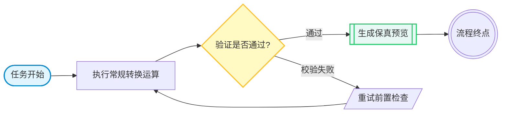
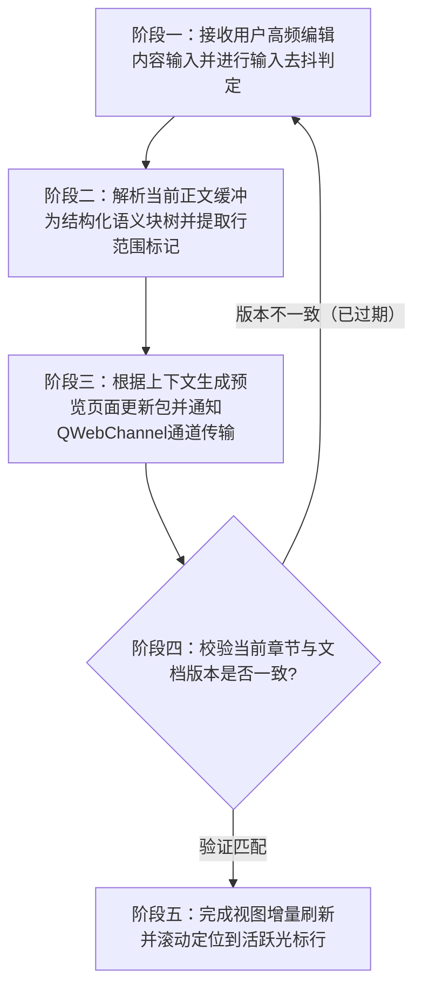

# Mermaid 流程图验收夹具

## 1. 复杂子图嵌套与方向

```mermaid
graph TD
    subgraph 接入层 [客户端接入网关]
        UI[桌面客户端界面] --> GW[API网关微服务]
    end

    subgraph 核心处理集群 [业务处理中心]
        direction TB
        GW --> Auth[身份鉴权验证中心]
        Auth --> Engine[排版与渲染核心引擎]
        Engine --> Cache[(分布式缓存集群)]
    end

    subgraph 存储与归档 [数据持久化]
        Engine --> DB[(文档数据库)]
        DB --> Backup[灾备备份存储]
    end
```

## 2. 节点形状、样式与连线标签

```mermaid
flowchart LR
    Start([任务开始]) --> Op[执行常规转换运算]
    Op --> Decision{验证是否通过?}
    Decision -->|通过| Success[[生成保真预览]]
    Decision -->|校验失败| Retry[/重试前置检查/]
    Retry --> Op
    Success --> EndNode(((流程终点)))

    style Start fill:#e1f5fe,stroke:#0288d1,stroke-width:2px;
    style Success fill:#e8f8f5,stroke:#2ecc71,stroke-width:2px;
    style Decision fill:#fff9c4,stroke:#fbc02d,stroke-width:2px;
```

## 3. 回边与超长中文标签

```mermaid
flowchart TD
    NodeA["阶段一：接收用户高频编辑内容输入并进行输入去抖判定"]
    NodeB["阶段二：解析当前正文缓冲为结构化语义块树并提取行范围标记"]
    NodeC["阶段三：根据上下文生成预览页面更新包并通知QWebChannel通道传输"]
    NodeD{"阶段四：校验当前章节与文档版本是否一致?"}
    
    NodeA --> NodeB
    NodeB --> NodeC
    NodeC --> NodeD
    NodeD -- 版本不一致（已过期） --> NodeA
    NodeD -- 验证匹配 --> Finish["阶段五：完成视图增量刷新并滚动定位到活跃光标行"]
```
