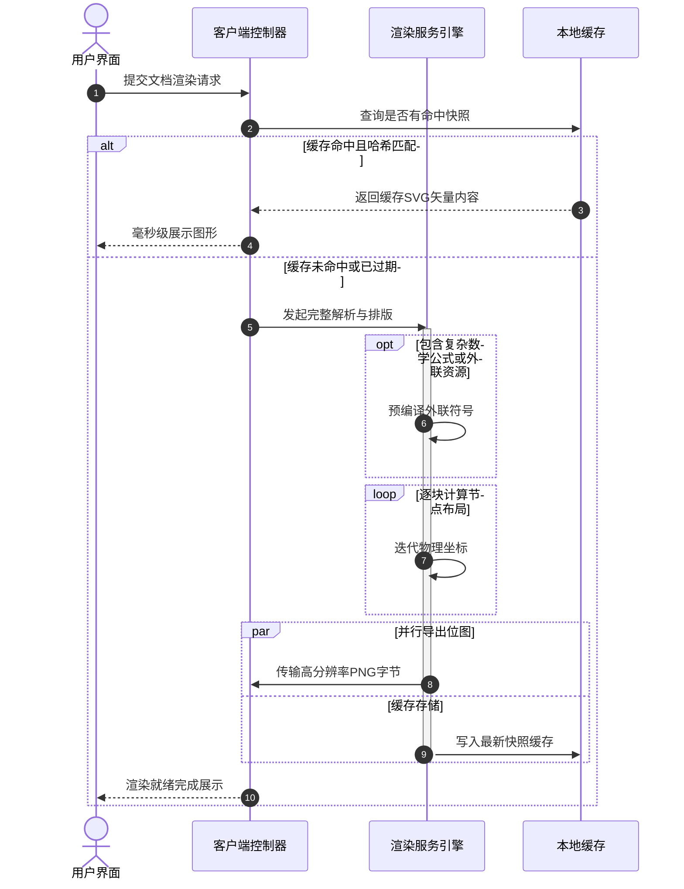
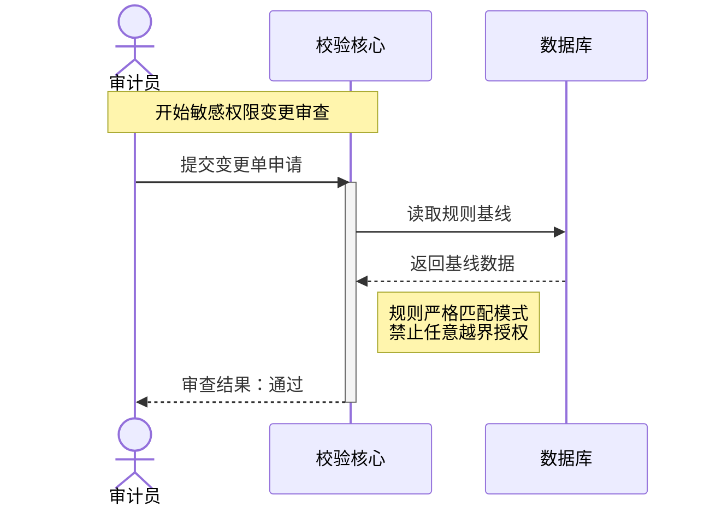

# Mermaid 时序图控制结构验收夹具

## 1. 控制块：alt/else、opt、loop、par/and

```mermaid
sequenceDiagram
    autonumber
    actor User as 用户界面
    participant Client as 客户端控制器
    participant Server as 渲染服务引擎
    participant Cache as 本地缓存

    User->>Client: 提交文档渲染请求
    Client->>Cache: 查询是否有命中快照
    
    alt 缓存命中且哈希匹配
        Cache-->>Client: 返回缓存SVG矢量内容
        Client-->>User: 毫秒级展示图形
    else 缓存未命中或已过期
        Client->>Server: 发起完整解析与排版
        activate Server
        
        opt 包含复杂数学公式或外联资源
            Server->>Server: 预编译外联符号
        end

        loop 逐块计算节点布局
            Server->>Server: 迭代物理坐标
        end

        par 并行导出位图
            Server->>Client: 传输高分辨率PNG字节
        and 缓存存储
            Server->>Cache: 写入最新快照缓存
        end
        deactivate Server

        Client-->>User: 渲染就绪完成展示
    end
```

## 2. 备注与激活状态

```mermaid
sequenceDiagram
    actor A as 审计员
    participant Core as 校验核心
    participant DB as 数据库

    Note over A,Core: 开始敏感权限变更审查
    A->>Core: 提交变更单申请
    activate Core
    Core->>DB: 读取规则基线
    DB-->>Core: 返回基线数据
    Note right of Core: 规则严格匹配模式<br/>禁止任意越界授权
    Core-->>A: 审查结果：通过
    deactivate Core
```
