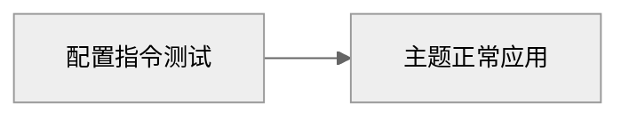
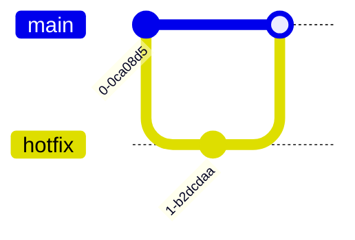

# Mermaid 边缘与错误用例验收夹具

## 1. 带前置配置（Directives）的合法图

```mermaid
%%{init: {'theme': 'neutral', 'themeVariables': { 'fontSize': '14px' }}}%%
flowchart LR
    A[配置指令测试] --> B[主题正常应用]
```

## 2. 语法错误用例（用于验证准确的错误提示与行号定位）

```mermaid
graph TD
    A --> 
    B -- 缺少目标节点
    ??? 非法字符语法错误
```

## 3. 未打包类型用例（用于验证降级提示，不崩溃）

```mermaid
gitGraph
    commit
    branch hotfix
    checkout hotfix
    commit
    checkout main
    merge hotfix
```
