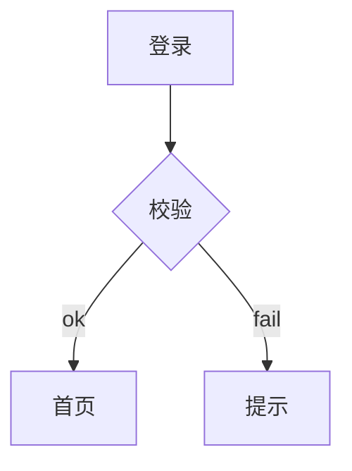
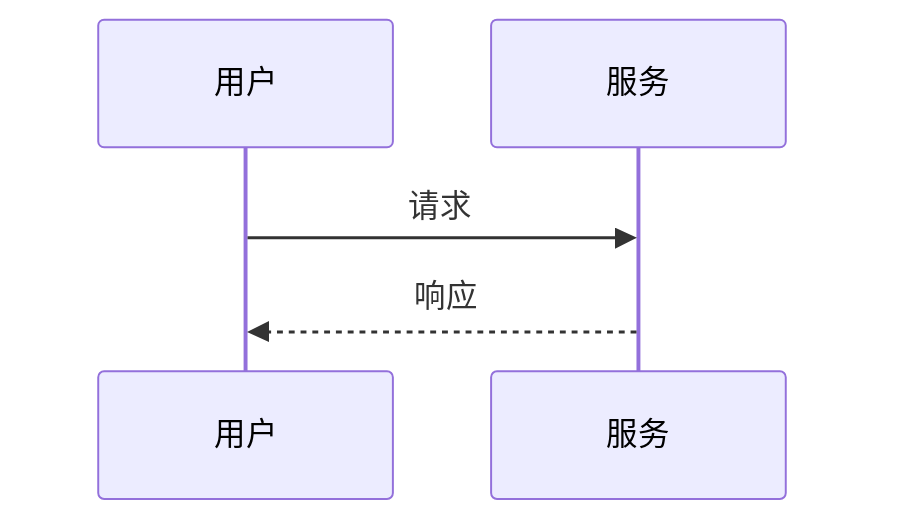

## 1.1 代码块

普通 python 围栏，包含缩进、Tab、空行、内嵌反引号与中英文：

```python
def 校验(值):
    if 值 is None:
        return "空值"
	return "正常"

# inline-backtick example
pattern = `  反引号  `
```

未声明语言的围栏：

```
plain text line 1

plain text line 2
```

## 1.2 Mermaid 图





## 1.3 图与题注


Figure: 登录流程 {#fig-flow}

## 1.4 表与题注

Table: 参数表 {#tbl-params}

| 参数 | 说明 |
| --- | --- |
| timeout | 超时秒数 |

Table: 发送时序 {#tbl-sequence}

| 步骤 | 动作 |
| --- | --- |
| 1 | 提交 |
| 2 | 回执 |

Table: 重复标识 {#tbl-params}

| 重复 | 行 |
| --- | --- |
| a | b |

## 1.5 引用

详见 @fig-flow 与 @tbl-sequence，另见 @fig-flow 和 @tbl-params。

不存在的引用：@fig-unknown。

<!-- PAGEBREAK -->

## 1.6 横向节

<!-- LANDSCAPE -->

Table: 宽表 {#tbl-wide}

| 列一 | 列二 | 列三 | 列四 | 列五 | 列六 |
| --- | --- | --- | --- | --- | --- |
| 1 | 2 | 3 | 4 | 5 | 6 |

<!-- END_LANDSCAPE -->

## 1.7 收尾

横向节之后回到纵向。