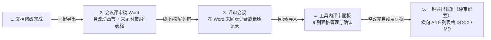

# 修订评审功能优化方案（Gemini 极简实用版）

> **方案定位**：面向内部日常文档编制与技术评审，砍掉冗余流程与重型架构，实现 **“改完即导 → 线下评审 → 录入确认 → 一键成表”** 的极简闭环。  
> **核心原则**：操作极简、零外部依赖（纯 Python OOXML 组装，不赖 Word COM）、表格即模型、发布不卡死。

---

## 一、已有方案对比与决策分析

目录下的三个方案各有侧重，但也存在不同程度的脱节或过度设计：

| 维度 | DeepSeek v4 方案 | GPT-5.6 方案 | Opus 5 方案 | **Gemini 决策方案** |
| :--- | :--- | :--- | :--- | :--- |
| **端与架构定位** | 客户端扩展 | ❌ 误判为 **Web 端应用**，设计了重型企业级工作流 | 客户端扩展 | **本地客户端（PySide6 + CLI）**，完全贴合项目实际 |
| **整体复杂度** | 中等偏高（五段式出稿 + 复杂表头反向解析 + 硬阻断门禁） | ❌ 极重（多轮次、项目排他锁、两轮复核、哈希防伪、多角色权限） | 中等偏高（底层埋书签、模糊行号反向对齐、全量快照归档） | **极简实用**（单会话基线驱动、章节级定位、即开即用） |
| **Word 导出技术** | 采用 `markdown_word.py` + Word COM（HTML 转 Word） | 未深入说明底层，抽象为服务接口 | 采用内核装配（复用 `scripts/build_docx.py` 的 lxml 直接组装） | **采纳 Opus 的内核装配路线**：纯 Python 读写 ZIP，零 Word 依赖，样式 100% 保真，抗加密软件 |
| **改动章节标题** | 未处理 Word 自动编号跳号问题 | 未提及细节 | 强制固定文字编号，关闭 Word `w:numPr` 自动编号 | **采纳 Opus 的编号处理**：解决只导出改动章节时章节号重编错乱的问题 |
| **评审意见回流** | 试图解析外来两行复杂合并单元格 DOCX | 校验 Review ID + 批注提取 + 签字解析 | 遍历 document.xml 书签跟踪批注游标，用 difflib 模糊匹配行号 | **极简双轨制**：面板直接录入（主）+ 提取 Word 末尾附录表格（辅）。不解析脆弱的批注与书签游标 |
| **发布门禁** | 未解决意见硬阻断发布 | 严格多条件门禁（未关闭阻断、未签字阻断） | 信息提示（info 级别，不阻断发布） | **采纳 Opus 的轻量门禁**：仅在发布前检查汇总提示，不卡死正常发布出稿 |

### 决策结论：去伪存真，极简至上
1. **彻底否决 GPT-5.6 方案**：完全搞错了产品形态（将桌面端当成了 Web 端），增加了大量的概念包袱和流程障碍，严重背离“内部使用、尽量简单”的要求。
2. **扬弃 Opus 5 方案**：
   - **吸纳其精华**：复用 `scripts/build_docx.py` 的 OpenXML 底层装配能力（不依赖本机 Word、表格图片样式不丢、固定章节编号、A4 横向纪要表）；
   - **剔除其繁琐**：砍掉多轮次归档快照树、砍掉底层注入书签、砍掉基于 `difflib` 的批注正文行号模糊对齐。
3. **优化 DeepSeek v4 方案的流程**：保留其直观易懂的 9 列表格主线，将 Word 导出由脆弱的 COM/HTML 升级为可靠的 OOXML 内核。

---

## 二、优化后的整体业务闭环（3 步走）



### 步骤详解
1. **改稿与导出**：
   - 作者在 doc-tool 中修改文档，改动面板自动统计增/删/改章节；
   - 点击 **「导出评审稿」**，系统快速生成一份《评审稿_vX.X.docx》（仅包含改动章节，保持原公司模板排版，文末自带空白 9 列评审记录表）。
2. **拿 Word 评审**：
   - 开会时直接投屏或发送此 Word 文件；
   - 记录员直接在文末的 9 列表格中录入提出的问题与责任人。
3. **生成评审记录**：
   - 会后回到工具，可通过 **「导入 Word 评审表」** 自动提取会议记录，或在工具内 **「评审」面板** 直接微调/补充；
   - 作者整改文档，点击 **「生成证据」**，工具自动根据 diff 填入修改结果（如“3.2节已修改，新增4行”）；
   - 点击 **「导出评审纪要」**，一键生成符合公司规范的正式横向 9 列《评审纪要.docx》（附带 Markdown 备份），直接用于归档或审批。

---

## 三、数据模型设计（9 列表格即数据模型）

评审数据模型直接对应公司标准的 9 列表格，存储于 `.state/reviews/comments.json`，与现有 `ReviewStore` 平滑兼容。

### 1. 标准 9 列表头映射

| 列号 | 评审纪要表头 | `ReviewComment` 扩展字段 | 填写方式 | 说明 |
| :---: | :--- | :--- | :--- | :--- |
| **1** | **序号** | `seq` (int) | 工具自增（1..n） | 导出时按顺序编号 |
| **2** | **提出人** | `author` (str) | 会议记录 / 手填 | 意见提出人 |
| **3** | **评审问题** | `text` (str) | 会议记录 / 手填 | 具体问题描述 |
| **4** | **责任人** | `assignee` (str) | 会议指定 / 手填 | 整改落实人 |
| **5** | **计划完成时间** | `planned_date` (str) | 会议指定 / 手填 | 格式：YYYY-MM-DD |
| **6** | **更改确认** | `confirm_status` (str) | 点击确认自动填充 | 状态或确认人（默认：`未确认`，确认后为 `已确认`） |
| **7** | **评审记录** | `review_note` (str) | 会议记录 / 手填 | 会议讨论结论（如：采纳/延期/按方案B修改） |
| **8** | **更改结果与证据** | `evidence` (str) | **一键自动采集** / 手填 | 自动比对提取（如：`第 3.2 节已修改（新增 4 行），见 v1.2`） |
| **9** | **遗留问题** | `open_issue` (str) | 手填 | 本次未闭环说明，无则填“无”或留空 |

### 2. 定位与扩展字段（内部使用）
- `chapter_no`: 关联章节号（如 `3.2`），点击可直接在左侧章节树或编辑器中跳转定位。
- `rel_path`: 关联的 Markdown 文件相对路径。
- `status`: `unresolved`（待改）/ `resolved`（已改）/ `confirmed`（已确认）。

---

## 四、核心功能实现设计

### 4.1 会议评审稿生成（纯内核装配，无 Word 依赖）

**实现载体**：新增 `doc_tool/application/review/review_builder.py`，复用 `scripts/build_docx.py` 的 OOXML 装配函数。

- **内容范围**：
  - 调用 `ContentSnapshot.diff()` 提取改动文件列表（`added`, `modified`, `deleted`）；
  - 仅打包改动的 Markdown 章节（排除 `_revision_record.md` 等元数据）。
- **版式与结构**：
  1. **封面/标题说明区**：标明《文档名称 - 修订评审稿（非正式出稿）》、文档版本、基线时间、改动章节清单。
  2. **正文改动章节**：
     - **章节号处理**：将章节号直接拼接在标题文字中（如 `3.7.9 呼吸机应用升级`），并移除 OpenXML 的自动多级列表属性 `w:numPr`，**彻底杜绝 Word 自动重新编号变成 1.1.1 的问题**。
     - **改动摘要**：在每个改动章节上方放置一个浅灰色的“改动摘要框”，简要列出该节改动情况（复用已有的 diff 统计能力）。
  3. **附录：空白评审记录表**：
     - 在文档最末尾直接插入标准的 9 列表格，预置 10~15 行空白行；
     - 会议现场记录人员可直接在 Word 里就地编辑此表格。

### 4.2 意见回流机制（简单可靠）

为了保证极简和 100% 可用性，提供两种录入方式：
1. **界面直录（最推荐）**：
   - 底部面板切到 **「评审」** Tab，就是一张原汁原味的 9 列表格；
   - 点击「新增行」，直接在表格单元格中打字；
   - 关联章节可通过下拉框快速选择当前改动的章节。
2. **从 Word 表格一键提取（辅助省力）**：
   - 线下评审人员在导出的 Word 文档末尾填写了表格后，点击面板的 **「导入 Word 评审表」**；
   - 纯 Python（`zipfile` + `lxml`）仅读取文档中的最后一个表格，按列标题（“提出人”、“评审问题”等）识别文本并导入到列表中；
   - **绝对不解析深层的复杂批注和书签游标**，解析逻辑简单健壮，即使在 WPS 里编辑保存过也能 100% 稳定读取。

### 4.3 更改结果与证据自动采集

作者根据评审意见修改了 Markdown 文档后：
- 在「评审」面板中选中某条意见，点击 **「生成证据」**；
- 工具自动比对基线与当前章节内容，自动生成描述文本并填入第 8 列：
  > 例：`3.7.9 章节已修改（新增 6 行，删减 2 行），修改时间: 2026-09-03`
- 作者也可以在单元格内直接追加说明（如：“已补充超时重试机制说明”）。

### 4.4 正式《评审纪要》生成

评审整改完成后，点击面板上的 **「导出评审纪要」**：
- **输出格式与视觉标准**：
  1. **Word 版本**（`output/review/评审纪要_文档名_版本_日期.docx`）：
     - 采用 **A4 横向页面**（A4 Landscape，宽 297mm × 高 210mm，页边距各 20mm），确保 9 列表格各列舒展，绝不拥挤。
     - **视觉样式**：
       - 表头：公司标准商务蓝底色（`#1F4E79`）+ 纯白加粗文本，垂直居中；
       - 奇偶行斑马纹：奇数行纯白（`#FFFFFF`），偶数行浅灰底（`#F8FAFC`），提升长表格审阅舒适度；
       - 边框：细网格边框（`#D1D5DB`），既清晰又不突兀；
       - 跨页规则：开启 `w:tblHeader`，表格分页时自动在每页顶部重复表头，纸质打印/多页翻阅无障碍。
     - **纪要元数据卡片**：在表格上方生成 2 列精简信息盒（文档编号/名称、版次、评审日期、组织人、闭环状态统计）。
  2. **Markdown 版本**（`output/review/评审纪要_文档名_版本_日期.md`）：同源输出纯文本 Markdown 9 列表格，便于 Git/SVN 提交留痕与快速预览。
- **发布门禁**：
  - 在正式发布的 `pre_publish_checks` 中仅作为 **提示项（Info）**，提示当前评审意见完成情况（如：“评审意见共 5 条：4 条已确认，1 条遗留”）；
  - **不阻断发布**，不给紧急出稿添堵。

---

## 五、界面与交互样式全面优化设计

在底部工具箱（`ChangesPanel` 改动面板旁）增加第 8 个 Tab：**「评审」**。遵循现有的 Qt 6 + QSS 体系，完全融合 `Microsoft YaHei UI` 字体栈与浅/深色主题，打造现代、直观、流畅的交互体验。

### 5.1 整体界面布局与视觉层级

```
+-----------------------------------------------------------------------------------------------------------------------------------+
|  [ 导出评审稿 (Word) ]  [ 导入 Word 评审表 ]  |  [ + 新增意见 ]  [ - 删除 ]  |  [ ⚡ 一键生成证据 ]  |  [ 📄 导出评审纪要 (DOCX) ]           |
|                                                |                              |                        |                                   |
|  ● 评审进度：共 6 条  |  ✓ 已确认 4  |  ⏳ 待确认 1  |  📌 遗留 1                                               🔍 [ 搜索过滤... ]         |
+-----------------------------------------------------------------------------------------------------------------------------------+
| 序号 | 提出人 | 章节  | 评审问题 (长文本自适应)       | 责任人 | 计划完成时间 | 更改确认       | 评审记录   | 更改结果与证据 (可自适应) | 遗留问题 |
|  1   | 张工   | 3.2   | 超时重试未说明最大重试次数    | 王工   | 2026-09-05   | [ ✓ 已确认 ]   | 采纳       | 3.2 补充重试3次机制       | 无       |
|  2   | 李工   | 5.1   | 补偿边界建议增加时序图        | 李四   | 2026-09-10   | [ ⏳ 待确认 ]  | 采纳       | 等待补充 Mermaid 流程图   | 流程图   |
|  3   | 陈工   | 7.3   | 缺少压力测试参数指标说明      | 赵六   | 2026-09-12   | [ 📌 遗留 ]   | 延后处理   | 待系统联调阶段确定        | 下版补充 |
+-----------------------------------------------------------------------------------------------------------------------------------+
| 状态提示：选中第 2 行 (章节 5.1) | 快捷键: [Enter] 编辑 [Tab] 切单元格 [Ctrl+N] 新增 [Del] 删除          [ 🎯 双击跳转正文定位 ] [ 批量确认 ] |
+-----------------------------------------------------------------------------------------------------------------------------------+
```

### 5.2 工具栏视觉设计与操作流指引（分级按钮与视觉隔断）

顶部工具栏按业务时序从左到右划分为四大功能组，使用垂直分隔线（`QFrame(VLine)`）自然隔断：

1. **【出稿与回流组】**（前期输入）：
   - `导出评审稿 (Word)`：`btnRole="primary"`（醒目蓝色），主操作入口，方便改完文档直接点；
   - `导入 Word 评审表`：`btnRole="secondary"`，会议后一键导入填好的 Word 表格。
2. **【行编辑维护组】**（录入与维护）：
   - `+ 新增意见`、`- 删除选中`：紧凑型按钮（`btnRole="compact"`），支持快速加行或清理。
3. **【闭环辅助组】**（整改与确认）：
   - `⚡ 一键生成证据`：带闪电图标，`btnRole="secondary"`，选中行后自动抓取 diff 填证据。
4. **【最终交付组】**（成果归档）：
   - `📄 导出评审纪要 (DOCX)`：`btnRole="primary"`，生成正式横向 A4 报告，绿色或重点高亮。
5. **【进度指标仪表盘（Status Dashboard）】**：
   - 紧随工具栏下方提供状态微型仪表盘，用扁平彩色圆点/胶囊直观展示当前闭环进展：
     - `● 总数: 6`（中性灰 `#4b5563`）
     - `✓ 已确认: 4`（清新翠绿 `#16a34a`）
     - `⏳ 待确认: 1`（琥珀橙黄 `#d97706`）
     - `📌 遗留: 1`（科技紫 `#7c3aed`）
   - 右侧配备轻量过滤搜索框（`QLineEdit`），可按提出人、责任人或关键字即时过滤表格。

### 5.3 9 列表格的高级交互与样式规范（QTableWidget 体验升级）

为避免原生表格呆板、输入繁琐的问题，针对 9 列表格定制交互委托（Delegate）与视觉样式：

#### 1. 字段宽度与对齐规范
- **居中紧凑列**：序号（50px）、提出人（80px）、章节（70px）、责任人（80px）、计划完成时间（110px）、更改确认（100px）；
- **自适应伸展列**：评审问题（最小 220px）、评审记录（最小 160px）、更改结果与证据（最小 240px）、遗留问题（120px）；设置 `horizontalHeader().setStretchLastSection(True)`，文本过长开启 `setWordWrap(True)` 自动折行，单元格舒适行高 36px~48px。

#### 2. “更改确认”列 —— 胶囊徽标与极速切换（Pill Badge）
- 不做枯燥的下拉框或纯文本，采用扁平圆角胶囊样式（Pill Badge）：
  - **已确认**：浅绿底（`#DCFCE7`）+ 深绿字（`#166534`）+ `✓ 已确认`
  - **待确认**：浅黄底（`#FEF3C7`）+ 橙褐字（`#92400E`）+ `⏳ 待确认`
  - **遗留**：浅紫底（`#EDE9FE`）+ 深紫字（`#5B21B6`）+ `📌 遗留`
- **极速交互**：双击该单元格，直接在“待确认 ⟷ 已确认”之间快速切换，并伴随行状态颜色即时刷新，无需繁琐的确认弹窗。

#### 3. “计划完成时间”列 —— 日历弹窗委托（Date Picker Delegate）
- 双击该单元格自动弹出轻量日历浮层（`QCalendarWidget`）；
- 底部附带 3 个快捷选择小标签：`[ 3天后 ]`、`[ 下周五 ]`、`[ 本月底 ]`，点击一键填入标准 `YYYY-MM-DD` 格式。

#### 4. “章节号”列 —— 改动章节智能联想下拉
- 双击章节号单元格时，弹出下拉列表，默认高亮当前项目所有发生改动的章节清单（如 `3.2 呼吸机参数`、`5.1 架构设计`），支持键盘首字母或拼音检索，避免手工打错章节编号。

#### 5. 键盘极速操作流（Keyboard Friendly）
- **回车键 (Enter)**：直接进入当前选中单元格编辑；编辑完成再次回车提交；
- **制表键 (Tab / Shift+Tab)**：像 Excel 一样在单元格间左右跳转；
- **新建行 (Ctrl+N)**：无论焦点在哪里，直接在表格最末尾追加一行，并自动将光标聚焦在“评审问题”列；
- **删除行 (Delete / Backspace)**：选中行后按 Del 键，弹出轻量确认气泡即刻删除。

#### 6. 右键快捷上下文菜单（Context Menu）
在表格任意行右击，弹出专业右键菜单：
- `🎯 定位到对应章节正文`（打开文件并在编辑器中高亮）
- `✓ 标记为已确认` / `⏳ 设为待确认` / `📌 标记为遗留`
- `⚡ 自动生成本条证据`
- `📋 复制该条评审记录`
- `❌ 删除此行意见`

---

### 5.4 关键流程弹窗与微交互设计

#### 1. 「导出评审稿」向导弹窗（精巧、透明、可控）
点击「导出评审稿」时，弹出规范的对话框，而非盲目静默导出：

```
+--------------------------------------------------------------+
| 导出会议评审稿 (Word)                                  [ X ] |
+--------------------------------------------------------------+
| 文档：系统详细设计说明书  |  版本：v2.6  |  改动章节：共 3 节       |
|                                                              |
| 请勾选本次需要纳入评审的改动章节：                           |
| [✓] 全选 / 取消全选                                          |
|  [✓] 3.2 升级通信接口（已修改，+12行 / -3行）                |
|  [✓] 3.7 异常恢复策略（已修改，+45行）                       |
|  [✓] 5.1 架构拓扑图（新增章节）                              |
|                                                              |
| 选项设置：                                                   |
|  ☑ 在文档末尾附带空白 9 列评审记录表 (供会议室就地填写)      |
|  ☑ 导出完成后自动打开 Word 查看                              |
|                                                              |
| 输出路径: output/review/评审稿-设计说明书-v2.6-0903.docx     |
|                                                              |
|                 [ 取消 ]      [ 开始导出 (DOCX) ]            |
+--------------------------------------------------------------+
```
- **贴心细节**：改动章节清晰可见，且支持临时剔除不需要开会评审的微小修改章节；一键导出后自动高亮打开所在文件夹或直接唤起 Word。

#### 2. 「一键生成证据」的即时动态反馈（Flash Highlight）
- 当点击「⚡ 一键生成证据」后，系统在 0.2 秒内计算完毕：
  - 对应的“更改结果与证据”单元格填入结构化文本：`【已修改】3.2节新增6行、删减2行 (2026-09-03)`；
  - 单元格背景浮现一层柔和的淡绿色闪烁光晕（300ms 渐隐动画），给予用户明确正向反馈；
  - 底部状态栏显示：`“已为第 1、2 行自动匹配改动并生成证据。”`

#### 3. 编辑器与章节树联动定位
- 双击表格中某行的章节号，触发联动：
  - 左侧章节目录树自动定位并选中该节点；
  - 中间 Markdown 编辑器瞬间打开对应 `.md` 文件，平滑滚动至首行或第一级标题位置，并以浅蓝底色高亮持续 1.5 秒，实现沉浸式审阅整改体验。

---

## 六、代码改造与落地规划

改动范围非常聚焦，仅需新增 2 个轻量服务模块和 1 个 UI 面板，所有既有出稿流程不受任何影响。

### 1. 模块分工与文件清单

| 类型 | 文件路径 | 职责 |
| :--- | :--- | :--- |
| **新增** | `doc_tool/application/review/review_docx.py` | 纯 Python OOXML 构建：组装改动章节评审稿、生成横向 A4 评审纪要 DOCX、读取 Word 末尾表格 |
| **新增** | `doc_tool/ui/content/review_panel.py` | 9 列表格面板（PySide6），含委托组件、快捷键、胶囊徽标、日历弹窗与工具栏 |
| **修改** | `doc_tool/application/review/review_store.py` | `ReviewComment` 补充 9 列表格字段（均设默认值，完美向后兼容旧数据） |
| **修改** | `doc_tool/ui/content/workspace.py` | 底部 Tab 栏挂载「评审」面板，连接改动通知与章节定位 |
| **修改** | `doc_tool/ui/content/changes_panel.py` | 改动面板顶部增加快捷按钮「导出评审稿」 |
| **新增** | `scripts/tests/test_review_docx.py` | 自动化测试：验证评审稿导出、Word 纪要生成、表格反向解析 |

### 2. 实施排期（轻量 3 步落地）

1. **第一步：底层数据与 Word 组装（1 天）**
   - 扩展 `ReviewComment` 字段；
   - 编写 `review_docx.py`，实现导出改动章节的 Word 评审稿（带固定章节号与文末空白表格）及 A4 横向评审纪要表。
2. **第二步：表格解析与证据自动生成（0.5 天）**
   - 实现离线提取 Word 附录表格逻辑；
   - 基于现有 diff 计算自动生成证据文本。
3. **第三步：UI 界面接线与联调测试（1 天）**
   - 完成「评审」Tab 表格界面交互（胶囊徽标、日历委托、向导弹窗、快捷键）；
   - 编写测试用例并全量回归。

---

## 七、方案总结

本方案紧密围绕用户的诉求：**“修改文档后，导出修改的，然后拿 Word 文件评审，最后再生成评审记录”**。
- **不造轮子、不堆概念**：抛弃了复杂的 Web 架构、评审轮次版本树、批注游标匹配和硬阻断审批流；
- **稳健可靠**：复用成熟的 OOXML 装配底座，导出不依赖 Word 软件，排版高度还原公司规范；
- **交互极度丝滑**：所见即所得的 9 列表格、彩色胶囊徽标状态、日历快捷选期、全键盘极速操作、双击联动编辑器定位，开完会几分钟就能出成果归档，真正实现省心、高效。

