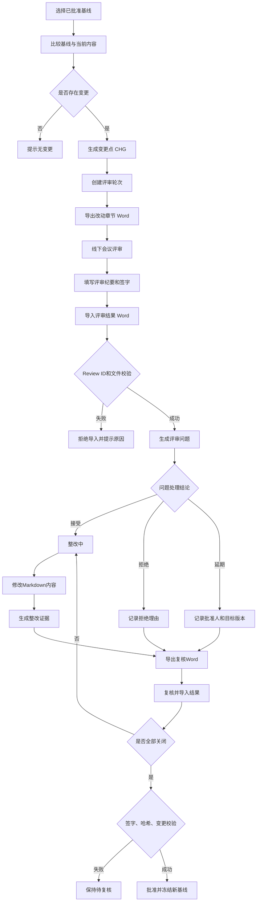
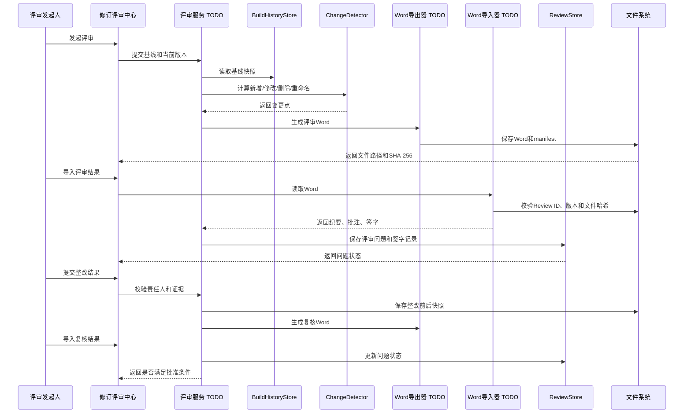
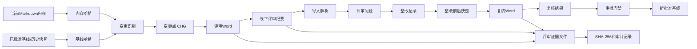

# 修订评审闭环功能详细方案

## 一、功能定位

- **端**：WEB 端

- **产品线/业务域**：文档编制与质量追溯

- **页面/模块**：修订评审中心

- **目标**：支持“确定基线 → 导出改动章节 Word → 线下评审 → 导入评审结果 → 整改 → 复核 → 批准并冻结基线”的完整闭环。

- 设计原则

  ：

  1. Word 作为线下评审载体，不直接作为 Markdown 正文源。
  2. 以评审轮次为管理单位，以变更点和评审问题为闭环单位。
  3. 所有评审结论、整改结果、复核记录和文件哈希均可追溯。
  4. 未完成的问题不能直接将评审轮次标记为通过。

现有可复用能力：

- 构建历史与内容快照：[history.py](D:/ai_develop_project_space/doc-tool/doc_tool/application/content/history.py)
- 现有评审意见、签字和审批门禁：[review_store.py](D:/ai_develop_project_space/doc-tool/doc_tool/application/review/review_store.py)
- 现有改动识别：[changes.py](D:/ai_develop_project_space/doc-tool/doc_tool/application/content/changes.py)
- 现有基线能力：[baselines.py](D:/ai_develop_project_space/doc-tool/doc_tool/application/content/baselines.py)

以下内容中，尚未在代码中确认的服务、接口或数据结构统一标记为 `TODO`。

### 修订评审中心

#### 功能描述

| 功能行为       | 输入/字段                                                | 实现说明                                                     | 异常与边界                                   |
| -------------- | -------------------------------------------------------- | ------------------------------------------------------------ | -------------------------------------------- |
| 发起评审轮次   | 评审名称、评审目的、当前版本、基线版本、评审人员、责任人 | 创建唯一 `Review ID`，记录当前内容快照和基线快照             | 无基线时必须先选择历史构建或创建初始基线     |
| 识别变更       | 基线与当前内容                                           | 识别新增、修改、删除、重命名章节，并生成 `CHG-xxx` 变更点    | `_revision_record.md` 等元数据不作为正文变更 |
| 影响分析       | 变更章节、图片、表格、引用关系                           | 关联受影响章节和引用关系                                     | 引用目标缺失时列为风险项                     |
| 导出评审 Word  | `Review ID`、变更点、章节内容                            | 生成评审封面、变更汇总、改动章节、删除内容附录、评审纪要表和签字页 | 无变更时禁止导出，或提示创建说明性评审       |
| 线下评审       | Word 文件                                                | 评审人员填写评审记录、整改要求、责任人和计划完成时间         | 正文默认只读，允许批注和表格填写             |
| 导入评审结果   | 返回的 Word 文件                                         | 校验 `Review ID`、文件结构和版本，提取纪要表、批注和签字信息 | 重复导入必须幂等；编号不匹配时禁止导入       |
| 整改处理       | 评审问题、责任人、期限                                   | 支持接受、拒绝、延期三类处理结论                             | 拒绝和延期必须填写理由                       |
| 生成复核 Word  | 未关闭问题、整改结果、证据                               | 仅导出待复核问题及相关章节                                   | 已关闭问题不再进入复核包                     |
| 完成复核       | 复核结论、复核人、复核时间                               | 复核通过后关闭问题                                           | 修改内容后必须重新计算哈希                   |
| 批准并冻结基线 | 评审轮次、签字记录、内容哈希                             | 将当前内容冻结为新的已批准基线                               | 存在未关闭问题、缺少签字或内容变化时禁止批准 |

评审轮次状态：

```
草稿 → 评审中 → 整改中 → 待复核 → 已批准
                     └────→ 已作废
```

最终评审纪要必须输出以下表格，第七列按用户指定名称保留：

| 序号 | 提出人 | 评审问题 | 责任人 | 评审记录 | 更改结果与证据 | 遗留问题 计划完成时间 | 更改确认 |
| ---- | ------ | -------- | ------ | -------- | -------------- | --------------------- | -------- |
| 1    |        |          |        |          |                |                       | 未确认   |
| 2    |        |          |        |          |                |                       | 未确认   |

字段规则：

- **提出人**：评审问题提出人。
- **评审问题**：具体、可验证的问题描述，必须关联章节或变更点。
- **责任人**：负责整改的人员或角色。
- **评审记录**：评审现场的讨论结论、依据和决策。
- **更改结果与证据**：整改说明、修改章节、提交版本、截图、测试结果或附件路径。
- **遗留问题 计划完成时间**：未解决问题及计划完成日期；无遗留问题填写“无”。
- **更改确认**：`未确认`、`已确认`、`退回`。

#### 流程图

````

````

关键判断：

1. 评审基线必须固定，不能使用“项目打开时状态”作为隐式基线。
2. 删除章节需要从基线快照中提取旧内容，放入 Word 删除内容附录。
3. 评审人员直接修改正文时，导入后只能作为“建议修改”，不得自动覆盖 Markdown。
4. 评审轮次批准后，后续任何内容修改都自动进入下一轮评审。

#### 时序图

````

````

#### 数据流图

````

````

主要数据对象：

| 数据对象 | 主要内容                                | 存储位置                                |
| -------- | --------------------------------------- | --------------------------------------- |
| 评审轮次 | Review ID、状态、基线、当前版本、参与人 | `TODO：.state/reviews/rounds.json`      |
| 变更点   | CHG 编号、章节、变更类型、前后哈希      | `TODO：评审轮次目录`                    |
| 评审问题 | 纪要表字段、状态、责任人、期限          | 现有 `comments.json` 扩展或新结构，TODO |
| 签字记录 | 签字人、角色、时间、备注、内容哈希      | 现有 `signoffs.json` 扩展               |
| 评审证据 | Word 原件、复核 Word、附件、SHA-256     | `review` 输出目录                       |
| 基线快照 | Markdown 文件及内容哈希                 | 现有历史/基线目录                       |

#### 方法设计

| 层级/入口 | 方法或接口                       | 输入                     | 输出                   | 主要职责       | 事务/权限/副作用       |
| --------- | -------------------------------- | ------------------------ | ---------------------- | -------------- | ---------------------- |
| 页面入口  | `TODO：create_review_round`      | 评审元数据、基线 ID      | Review ID              | 创建评审轮次   | 校验编辑权限，写入轮次 |
| 变更识别  | `BuildHistoryStore.diff`         | 旧历史 ID、新历史 ID     | added/modified/deleted | 计算章节级差异 | 只读                   |
| 变更明细  | `BuildHistoryStore.text_diff`    | 两个历史 ID、路径        | unified diff           | 生成文本差异   | 只读                   |
| 评审意见  | `ReviewStore.add_comment`        | 问题、提出人、路径、行号 | `ReviewComment`        | 保存评审问题   | 原子写入               |
| 评审状态  | `ReviewStore.set_resolved`       | 问题 ID、状态            | 更新后的问题           | 更新关闭状态   | 记录时间               |
| 签字      | `ReviewStore.append_signoff`     | 姓名、角色、备注         | `Signoff`              | 追加签字记录   | 只允许追加             |
| Word导出  | `TODO：export_review_docx`       | Review ID、变更点        | Word路径、哈希         | 生成评审 Word  | 保存manifest和证据     |
| Word导入  | `TODO：import_review_docx`       | Word路径                 | 纪要、批注、签字       | 解析并幂等导入 | 校验来源和文件结构     |
| 整改提交  | `TODO：submit_rectification`     | 问题ID、结果、证据       | 整改记录               | 保存整改结果   | 责任人权限校验         |
| 复核导出  | `TODO：export_recheck_docx`      | 未关闭问题               | 复核Word               | 生成复核材料   | 绑定当前内容哈希       |
| 批准门禁  | `approval_gate`                  | 问题、签字、必需角色     | `GateResult`           | 判断能否批准   | 未通过时禁止冻结       |
| 基线冻结  | `TODO：freeze_approved_baseline` | Review ID、内容快照      | 新基线 ID              | 冻结批准内容   | 加项目锁并审计         |

#### 核心逻辑

1. **基线规则**
   默认使用最近一次“已批准”评审基线；首次评审必须由用户显式选择历史构建或创建初始基线。

2. **变更规则**
   支持新增、修改、删除、重命名章节；变更点必须具备稳定编号、章节路径、变更类型和前后内容哈希。

3. **问题状态规则**

   ```
   待处理
   ├─ 接受 → 整改中 → 待复核 → 已关闭
   ├─ 不接受 → 填写理由 → 已关闭
   └─ 延期 → 填写批准人和目标版本 → 延期
   ```

4. **关闭规则**
   “已修改文档”只能将问题置为“待复核”，不能直接关闭。复核人确认整改结果后，才允许变为“已关闭”。

5. **批准规则**
   同时满足以下条件才可批准：

   - 所有必须处理的问题均已关闭；
   - 所有变更点均有评审结论；
   - 必需角色已签字；
   - 当前内容哈希与复核材料一致；
   - 最近一次复核后没有继续修改内容；
   - 评审证据文件已保存并完成 SHA-256 校验。

6. **导入幂等规则**
   以 `Review ID + 文件SHA-256` 作为导入幂等键。同一文件重复导入只返回原导入结果，不重复创建问题。

7. **Word兼容规则**
   可见位置保留 `Review ID` 和 `CHG-xxx`；隐藏元数据仅作为辅助信息。WPS、LibreOffice 清除隐藏信息后，仍可通过可见编号匹配。

8. **正文保护规则**
   评审 Word 中正文默认只读，仅允许填写纪要表、批注和签字信息。正文发生变化时必须人工确认，不允许自动覆盖 Markdown。

9. **并发与一致性**
   创建轮次、导入结果、提交整改、批准冻结均需使用项目锁；批准前重新计算内容哈希，防止签字后内容被修改。

10. **证据规则**
    每条问题至少关联一个章节或变更点；整改结果应关联修改文件、版本、截图、测试记录或附件。证据缺失时不得标记为“已确认”。

11. **权限与审计**
    评审发起人负责创建轮次，责任人负责提交整改，复核人负责关闭问题，批准人负责冻结基线。所有状态变化记录操作者、时间和原因。

12. **异常处理**
    基线缺失、Word损坏、Review ID不匹配、文件过期、章节已删除、重复导入和哈希不一致时，系统必须拒绝静默处理并给出明确原因。

13. **第一阶段范围**
    实现评审轮次、改动章节 Word 导出、纪要表导入、整改、复核 Word、审批门禁和基线冻结。

14. **后续范围**
    原生 Word 修订痕迹自动合并、多份评审 Word 合并、电子签名、在线协同批注列为后续版本，避免第一阶段引入过高的文档解析风险。